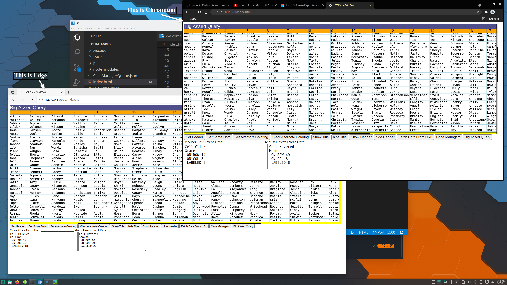
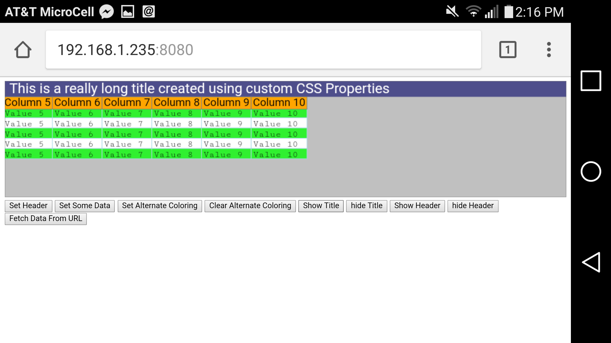
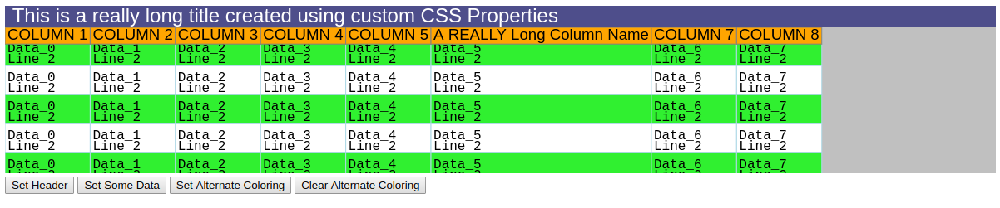

# LCTDataGrid

Yet another DataGrid because I hate something about every other Javascript Data Grid out there

I started implementing this in TypeScript mainly to acclimate myself with creation of a lightweight control for my DataGrid needs. Being unimpressed with the effort necessary to employ other "Grid" controls in my projects. Implemented as a rendering component onto an HTML Canvas as opposed to a highly stylized set of HTML table elements, I feel it should be responsive enough even on low power systems and mobile devices, where a DOM approach would create a very sluggish operation environment on a grid with a LOT of data. Care will be exercised to keep the Canvas object as small as possible by only rendering the visible parts of the resulting Grid, even as there may be thousands of Cells that are effectively OFF-Screen...


Using Is Simple

include the Grid Javascript in your HTML someplace

        <script src="LCTDataGrid.js"></script>

Then Place a canvas somewhere in your content that you want to rasterize the grid on.

        <div id="LCTDataGrid" style="height:70vh; width: 98vw" >
                <canvas id="LCTDataGridCanvas" class="LCTDataGrid" ></canvas>
        </div>

In this case its in a DIV that is set to be 70% of the browsers height and 98% of the browsers width...
The canvas is inside of that div set to consume all of its available space...

Then attach the grid to the canvas with...

        var el = document.getElementById('LCTDataGridCanvas');

        var DG = new LCTDataGrid(el);

        DG.FillCanvas();

The Grid will be drawn on the canvas. The index.html page will shows a number of other setup items like configuring an extended CSS block to configure the grids visuals (Fonts and Colors and sample data and so on)

Also shown in that sample file are wiring to grid events for cells being clicked on and hovered over and touched and so on.

There are also some other buttons that populate the grid with data from URLS and webservices

For Grid contents where Scrollbars appear...

- MouseWheel will scroll up and down
- CTRL MouseWheel will scroll left and right
- If there is only a bottom scrollbar visible Mousewheel will scroll left and right without CTRLS

## Properties

Most of these property names are self explanatory Type and default values are shown. Additional explanation where meaning might be ambiguous 

- HorizontalScrollBarVisible: boolean = false;
- VerticleScrollBarVisible: boolean = false;
- SliderBackColor: string = "#FFFFFF";
- SliderForeColor: string = "#3f3f3f";
- SliderThickness: number = 10;
- CalculatedGridHeightTotal: number = 0;<br>
        This represents the total height of the grid fully rendered (Not its on-screen representation)
- CalculatedGridWidthTotal: number = 0;><br>
        This represents the total width of the grid full rendered (Not its onscreen representation)

- linecolor: string = "#000000";
- backcolor: string = "#C0C0C0";

- OutlineOn: boolean = true;
- OutlineColor: string = "#808080";

- Title: string = "Grid Title Here";
- TitleHeight: number = 15;
- TitleBackColor: string = "#3030C0";
- TitleForeColor: string = "#FFFFFF";
- TitleVisible: boolean = true;
- TitleFont: string = "18pt Courier";

- GridHeaderVisible: boolean = true;
- GridHeaderBackColor: string = "#FFFF00";
- GridHeaderForeColor: string = "#000000";
- GridHeaderOutlineColor: string = "#808080";
- GridHeaderFont: string = "14pt Courier";

- GridHeader: string[] = [];<br>
        Single dimensional array of the Column labels applied to the grids contents 
- GridRows: string[] = [];<br>
        2 Dimensional array of the grids actual displayed values 
- GridColAlignments: string[];<br>
        Single Dimensional array of "","LEFT","CENTER","RIGHT" values for forced cell alignment of content.<br>
        Yet to be implemented 
- GridHeaderHeight: number = 0;

- CellBackColor: string = "#FFFFFF";
- CellHighlightBackColor: string = "#AAAAAA";
- RowSelectedBackColor: string = "#BBBBBB";
- AlternateCellBackColor: string = "#30F030";
- AlternateRowColoring: boolean = false;<br>
        Forced Alternate row background coloring IE The Greenbar effect
- CellForeColor: string = "#000000";
- CellOutlineColor: string = "#808080";
- CellFont: string = "14pt Courier";
- CellWidths: number[] = [];
- CellHeights: number[] = [];

- HoverHighlight: boolean = true;
- RowHoveredOver: number = -1;

- SelectedRow: number =-1;
- SelectedRows: number[] = [];

- HorizontalOffset: number = 0;
- VerticleOffset: number = 0;
- MaximumHorizontalOffset: number = 0;
- MaximumVerticleOffset: number = 0;
- ScrollButtonDown: boolean = false;

- CalculatedHorizontalScale: number = 0;
- CalculatedVerticleScale: number = 0;

- DoConsoleLogging = true; // on by default

## Methods

-  SetGridOutlineColor(col: string) 
-  SetCellBackColor(col: string) 
-  SetCellForeColor(col: string) 
-  SetAlternateCellBackColor(col: string) 
-  SetHoverHighlight(trigger: boolean) 
-  SetAlternateRowColoring(trigger: boolean) 
-  SetTitleBackColor(col: string) 
-  SetTitleForeColor(col: string) 
-  SetTitleFont(fnt: string) 
-  SetTitle(title: string) 
-  SetTitleVisible(flag: boolean) 
-  SetHeaderVisible(flag: boolean) 
-  SetHeaderBackgroundColor(col: string) 
-  SetHeaderForeGroundColor(col: string) 
-  SetHeaderOutlineColor(col: string) 
-  SetBackgroundColor(col: string) 
-  SetHeaderFont(fnt: string) 
-  SetDrawColor(col: string) 
-  SetSliderBackColor(col: string) 
-  SetSliderForeColor(col: string) 
-  SetSliderThickness(val: number) 
-  SetGridRowsJSON(TheRows: string)
-  SetGridColAlignments(TheColAlignments: string[]) 
-  SetSelectedRow(TheRowToHighlight: number) 
-  SetSelectedRows(TheRowsToHighlight: number[])
-  ClearSelectedRows() 
-  ClearGridContents() 
-  FillCanvas() 
-  RedrawCanvas() 
-  PopulateFromJSONUrl(DukeOfURL: string) 
-  SetDataFromJSONCall(data: any) 
-  SetGridHeader(Headers: string[]) 
-  GetImage() 

  // Event Handlers Internal
  
-  HandleKeyDown(ev: _KeyboardEvent) 
-  HandleKeyUp(ev: _KeyboardEvent) 
-  HandleContextMenu(ev: Event) 
-  HandleDoubleClick = (ev: MouseEvent)   
-  HandleTouchStart = (ev: TouchEvent)  
-  HandleTouchEnd = (ev: TouchEvent)
-  HandleTouchMove = (ev: TouchEvent) 
-  HandleMouseWheel = (ev: WheelEvent)
-  HandleMouseMove = (ev: MouseEvent) 
-  HandleMouseDown = (ev: MouseEvent) 
-  HandleMouseUp = (ev: MouseEvent) 
-  HandleMouseOut = (ev: MouseEvent)
-  HandleMouseIn = (ev: MouseEvent) 

Events Bubbled Out to container

Taken from the Index Page where we wire up events manually

```
        el.addEventListener('MOUSEOUT',
            function(e) {
                document.getElementById('MOUSELBL').innerHTML = "";
            },true);


        el.addEventListener('MOUSEDOVER',
            function(e) {
                document.getElementById('MOUSELBL').innerHTML = "MOUSING OVER GRID";
            },true);

        el.addEventListener('CELLCLICKED', 
            function (e) { 
                var v = "Cell Clicked \n" + 
                    DG.CELLCLICKEDINFO.CELLCLICKED + "\n ON ROW " + 
                    DG.CELLCLICKEDINFO.ROWCLICKED + "\n ON COL " + 
                    DG.CELLCLICKEDINFO.COLCLICKED + "\n LABELED " +
                    DG.CELLCLICKEDINFO.COLNAME;
                
                    var el = document.getElementById('MOUSECLICKAREA');

                    el.innerHTML = v;
                }, true);

        el.addEventListener('CELLHOVERED', 
            function (e) { 
                var v = "Cell Hovered \n" + 
                    DG.CELLCLICKEDINFO.CELLCLICKED + "\n ON ROW " + 
                    DG.CELLCLICKEDINFO.ROWCLICKED + "\n ON COL " + 
                    DG.CELLCLICKEDINFO.COLCLICKED + "\n LABELED " +
                    DG.CELLCLICKEDINFO.COLNAME;
                
                    var el = document.getElementById('MOUSEHOVERAREA');

                    el.innerHTML = v;
                }, true);

        el.addEventListener('CELLDOUBLECLICKED',
            function (e) {
                var v = "Cell DoubleClicked \n" + 
                    DG.CELLCLICKEDINFO.CELLCLICKED + "\n ON ROW " + 
                    DG.CELLCLICKEDINFO.ROWCLICKED + "\n ON COL " + 
                    DG.CELLCLICKEDINFO.COLCLICKED + "\n LABELED " +
                    DG.CELLCLICKEDINFO.COLNAME;
                
                    var el = document.getElementById('MOUSEDBLCLICK');

                    el.innerHTML = v;
                }, true);


```


## Screenshots

Shown below is the grid running the Large Query Test from its testing harness in both Chromium and Edge in Linux...



The Grid running on a Phone...



The Grid in Greenbar mode with multiline content


