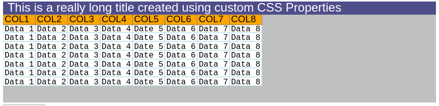

# LCTDataGrid

Yet another DataGrid because I hate something about every other Javascript Data Grid out there

I started implementing this in TypeScript mainly to acclimate myself with creation of a lightweight control for my DataGrid needs. Being unimpressed with the effort necessary to employ other "Grid" controls in my projects. Implemented as a rendering component onto an HTML Canvas as opposed to a highly stylized set of HTML table elements, I feel it should be responsive enough even on low power systems and mobile devices, where a DOM approach would create a very sluggish operation environment on a grid with a LOT of data. Care will be exercised to keep the Canvas object as small as possible by only rendering the visible parts of the resulting Grid, even as there may be thousands of Cells that are effectively OFF-Screen...

Using Is Simple

include the Grid Javascript in your HTML someplace

        

Then Place a canvas somewhere in your content that you want to rasterize the grid on.

        

                <canvas id="LCTDataGridCanvas" class="LCTDataGrid" ></canvas>
        

In this case its in a DIV that is set to be 70% of the browsers height and 98% of the browsers width...
The canvas is inside of that div set to consume all of its available space...

Then attach the grid to the canvas with...

        var el = document.getElementById('LCTDataGridCanvas');

        var DG = new LCTDataGrid(el);

        DG.FillCanvas();

The Grid will be drawn on the canvas. The index.html page will shows a number of other setup items like configuring an extended CSS block to configure the grids visuals (Fonts and Colors and sample data and so on)

Also shown in that sample file are wiring to grid events for cells being clicked on and hovered over and touched and so on.

There are also some other buttons that populate the grid with data from URLS and webservices

For Grid contents where Scrollbars appear...
- MouseWheel will scroll up and down
- CTRL MouseWheel will scroll left and right

## Screenshots

Shown below is the grid running the Large Query Test from its testing harness in both Chromium and Edge in Linux...

